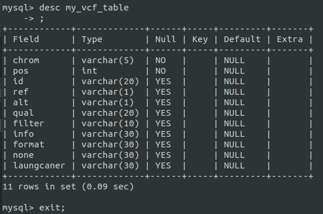

```{r setup, include=FALSE}
knitr::opts_chunk$set(echo = TRUE)
```

> **TASK:** Create a MySQL table, load the VCF file data and also retive based on filter.

## Create a MySQL table from MySQL CLI
Table Name: my_vcf
```{bash, eval=FALSE}
CREATE DATABASE my_vcf;
CREATE TABLE my_vcf.my_vcf_table (
    chrom VARCHAR(5) NOT NULL,
    pos INT(30) NOT NULL,
    id VARCHAR(20),
    ref VARCHAR(1),
    alt VARCHAR(1),
    qual VARCHAR(20),
    filter VARCHAR(10), 
    info VARCHAR(30), 
    format VARCHAR(30),
    none VARCHAR(30),
    laungcaner VARCHAR(30)
    );
```




## Create a connection in R
```{r}
library(RMySQL)

con <- dbConnect(MySQL(), 
                 username = 'sangram', password = 'Bio@87654',
                 dbname = 'my_vcf', host = 'localhost')
```

## Load data into `my_vcf.my_vcf_table`
```{r, eval=FALSE}
dbSendQuery(con, "LOAD DATA INFILE 'output/vcf_data.csv'
             INTO TABLE my_vcf_table
             FIELDS TERMINATED by ','
             ENCLOSED BY '\"'
             LINES TERMINATED BY '\r\n'
             IGNORE 1 LINES;")
```